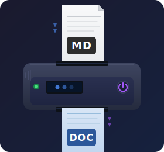

# markdown2docx

Convert GitHub Flavored Markdown files to DOCX format.



## Features

- Headings (h1-h6)
- Bold, italic, strikethrough text
- Inline code and fenced code blocks with syntax highlighting (via Pygments)
- Links (clickable hyperlinks)
- Images (embedded in document)
- Tables with header row and column alignment
- Ordered, unordered, and task lists
- Blockquotes with left border
- GitHub-style alerts (NOTE, TIP, IMPORTANT, WARNING, CAUTION)
- Horizontal rules
- Mermaid diagrams (rendered to PNG via `mmdc`)

## Installation

```bash
python -m venv .venv
source .venv/bin/activate
pip install -r requirements.txt
```

For Mermaid diagram support, install the Mermaid CLI:

```bash
npm install -g @mermaid-js/mermaid-cli
```

To install as an executable under `~/.local/bin`, run:

```bash
make install
```

## Usage

```bash
# Show help
markdown2docx --help

# Convert a single file
markdown2docx document.md

# Convert multiple files
markdown2docx file1.md file2.md file3.md

# Specify output directory
markdown2docx document.md -o ./docs

# Convert all example files
markdown2docx examples/*.md -o output
```

## Options

| Option           | Description                                      |
| ---------------- | ------------------------------------------------ |
| `FILES`          | One or more Markdown files to convert (required) |
| `-o`, `--output` | Output directory (default: `./output`)           |
| `--help`         | Show help message                                |

## Output

Output files are saved as `<original-filename>.docx` in the output directory. For example, `README.md` becomes `output/README.md.docx`.
