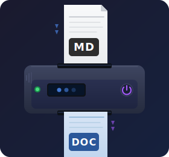

# markdown2docx / markdown2confluence

Convert GitHub Flavored Markdown files to DOCX or Confluence pages.



## Features

- Headings (h1-h6)
- Bold, italic, strikethrough text
- Inline code and fenced code blocks with syntax highlighting
- Links and images
- Tables with header row and column alignment
- Ordered, unordered, and task lists
- Blockquotes
- GitHub-style alerts (NOTE, TIP, IMPORTANT, WARNING, CAUTION)
- Horizontal rules
- Mermaid diagrams (rendered to PNG via `mmdc`)

Confluence-specific:

- Inline comment preservation on page updates
- Attachment change detection (skips unchanged images)
- Alerts rendered as Confluence panel macros

## Installation

```bash
python -m venv .venv
source .venv/bin/activate
pip install -r requirements.txt
```

For Mermaid diagram support:

```bash
npm install -g @mermaid-js/mermaid-cli
```

To build and install both tools as executables under `~/.local/bin`:

```bash
make clean install
```

## Usage

### markdown2docx

```bash
markdown2docx document.md
markdown2docx file1.md file2.md -o ./docs
```

### markdown2confluence

Requires a config file at `~/.config/markdown2confluence/config.toml` with the following information:

```toml
# Confluence credentials
# Copy this file to markdown2confluence.toml (current directory)
# or ~/.config/markdown2confluence/config.toml (user config)

# Your Atlassian account email
email = ""
# API token from https://id.atlassian.com/manage-profile/security/api-tokens
api_token = ""
# Confluence base URL, e.g. https://yourorg.atlassian.net
url = ""
```

API tokens can be generated at https://id.atlassian.com/manage-profile/security/api-tokens.

```bash
# Create a new page under a parent
markdown2confluence document.md --parent-id 123456 --space-key MYSPACE

# Update an existing page
markdown2confluence document.md --page-id 789012
```

Run either command with `--help` for all options.
