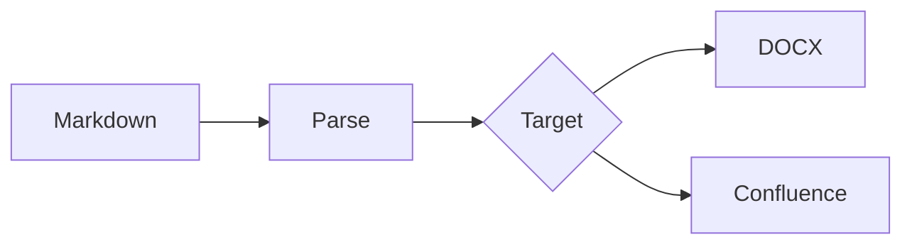

# Full Feature Demo

A consolidated example covering all supported Markdown features.

## Text Formatting

This paragraph has **bold**, *italic*, ~~strikethrough~~, and `inline code`.
You can also combine **bold and *nested italic*** together.

Visit [GitHub](https://github.com) for more info.

See the [Code Blocks](#code-blocks) section below, or jump to [Tables](#tables) for data examples.

## Headings

### Third Level

#### Fourth Level

##### Fifth Level

###### Sixth Level

## Code Blocks

```python
def greet(name: str) -> str:
    return f"Hello, {name}!"

if __name__ == "__main__":
    print(greet("World"))
```

```
Plain text block with no language specified.
```

## Tables

| Name    | Age |     City |
| :------ | :-: | -------: |
| Alice   | 30  | New York |
| Bob     | 25  |   London |
| Charlie | 35  |    Tokyo |

## Lists

### Unordered

- Item one
- Item two
  - Nested item
- Item three

### Ordered

1. First
2. Second
3. Third

### Task List

- [x] Completed task
- [ ] Pending task
- [x] Another done task

## Blockquote

> This is a blockquote.
> It can span multiple lines.

## Alerts

> [!NOTE]
> This is a note with **bold** and `inline code`.

> [!TIP]
> A helpful tip for the reader.

> [!IMPORTANT]
> Crucial information that *must not* be overlooked.

> [!WARNING]
> Urgent information demanding immediate attention.

> [!CAUTION]
> Potential negative outcomes of certain actions.

## Images


## Mermaid Diagram



## Horizontal Rule

---

That's it!
