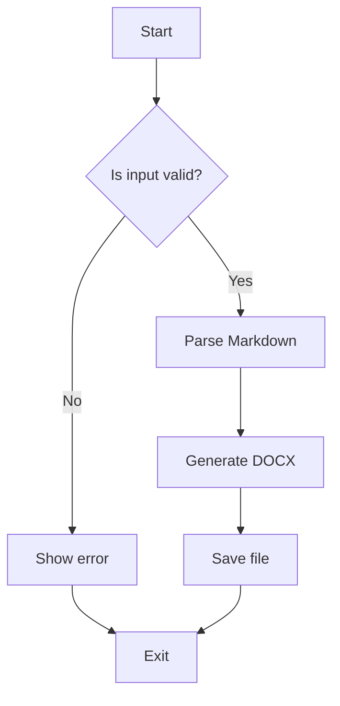
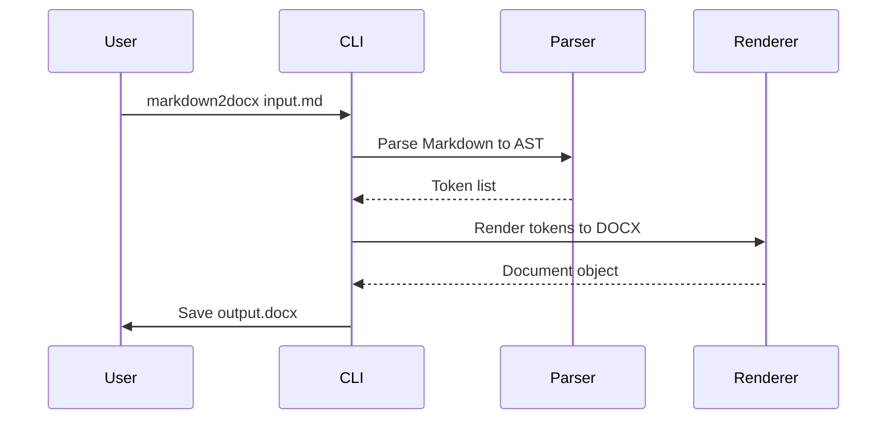

# Mermaid Diagrams

Mermaid diagrams are rendered to PNG via `mmdc` (Mermaid CLI) during conversion.

> [!NOTE]
> The `mmdc` command must be installed for diagrams to render.
> Install it with `npm install -g @mermaid-js/mermaid-cli`.

## Flowchart

## Sequence Diagram

